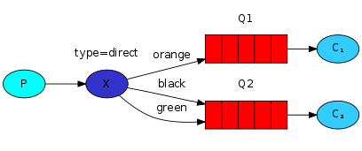
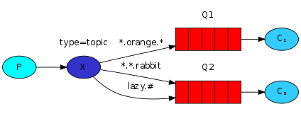
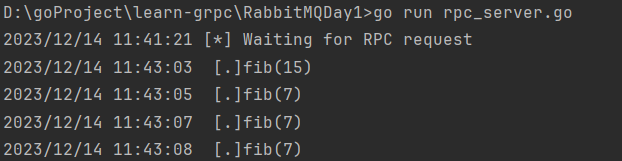
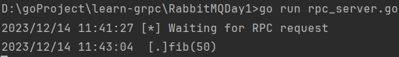

# 本地或服务器上启动RabbitMQ服务

## demo1

### shell1
```shell
go run sent.go
```
### shell2
```shell
go run receive.go
```

## demo2 生产者发布消息到mq，启动两个消费者去完成模拟的耗时任务,以及保证任务前后一致性针对消费者的手动返回确认，针对mq服务宕机做的队列和消息持久化

### shell1
```shell
go run worker.go
```
### shell2
```shell
go run worker.go
```
### shell3
```shell3
go run new_task.go msg1.
go run new_task.go msg2..
go run new_task.go msg3...
go run new_task.go msg4....
go run new_task.go msg5.....
```
### 查看是否有忘记确认 命令,由于我的RabbitMQ是启动在223.26.59.136这个服务器上的docker容器
```shell
docker exec -it [container_id] /bin/bash
```

```shell
rabbitmqctl list_queues name messages_ready messages_unacknowledged
```

| name  | messages_ready | messages_unacknowledged |
|:------|:--------------:|------------------------:|
| hello |       0        |                       1 |

| name  | messages_ready | messages_unacknowledged |
|:------|:--------------:|------------------------:|
| hello |       0        |                       0 |

## demo3 发布/订阅,简单日志系统,学习使用fanout交换器
windows 终端将标准输出流重定向到日志文件中命令 2>&1 表示将标准错误重定向到与标准输出相同的地方
```shell
go run receive_logs.go > logs_from_rabbit.log 2>&1 //将结果写入日志文件
```
```shell
go run receive_logs.go //打印处理
```
```shell
go run emit_log.go  //发布
```

```shell
rabbitmqctl list_bindings //查看绑定情况
```

## demo4 路由学习,当roting_key匹配到binding key时，消息就会被路由到那个队列上
日志系统将所有消息广播给所有消费者。我们希望扩展这一点，允许根据消息的严重性过滤消息。例如，我们可能希望将日志消息写入磁盘的脚本只接收严重错误，而不会在warning或info日志消息上浪费磁盘空间。

我们使用fanout交换器，这并没有给我们很大的灵活性——它只能进行无脑广播。

我们将使用direct交换器。direct交换器背后的路由算法很简单——消息进入其binding key与消息的routing key完全匹配的队列。





```shell
go run receive_logs_direct.go info warning error
# => [*] Waiting for logs. To exit press CTRL+C
```
```shell
go run receive_logs_direct.go warning error > logs_from_rabbit.log 2>&1
```
例如，要发出error日志消息，只需输入：
```shell
go run emit_log_direct.go error "Run. Run. Or it will explode."
# => [x] Sent 'error':'Run. Run. Or it will explode.'

```

## demo5 学习topic类型的交换器
topic交换器

topic交换器功能强大，可以像其他交换器一样运行。

当队列用“#”（井号）绑定键绑定时，它将接收所有消息，而与路由键无关，就像在fanout交换器中一样。

当在绑定中不使用特殊字符“*”（星号）和“#”（井号）时，topic交换器的行为就像direct交换器一样。





+ *（星号）可以代替一个单词。
+ ＃（井号）可以替代零个或多个单词

## demo6 RPC学习 客户端远程过程调用获取第n个斐波那契数fib(n)

>关联ID（Correlation Id）

在上面介绍的方法中，我们建议为每个RPC请求创建一个回调队列。这是相当低效的，但是幸运的是，有一种更好的方法——让我们为每个客户端创建一个回调队列。

这就引发了一个新问题，在该队列中收到响应后，尚不清楚响应属于哪个请求。这个时候就该使用correlation_id这个属性了。针对每个请求我们将为其设置一个唯一值。随后，当我们在回调队列中收到消息时，我们将查看该属性，并基于这个属性将响应与请求进行匹配。如果我们看到未知的correlation_id值，则可以放心地丢弃该消息——它不属于我们的请求。

你可能会问，为什么我们应该忽略回调队列中的未知消息，而不是报错而失败？这是由于服务器端可能出现竞争状况。尽管可能性不大，但RPC服务器可能会在向我们发送答案之后但在发送请求的确认消息之前死亡。如果发生这种情况，重新启动的RPC服务器将再次处理该请求。这就是为什么在客户端上我们必须妥善处理重复的响应，并且理想情况下RPC应该是幂等的。

>总结


我们的RPC工作流程如下：

+ 客户端启动时，它将创建一个匿名排他回调队列。
+ 对于RPC请求，客户端发送一条消息，该消息具有两个属性：reply_to（设置为回调队列）和correlation_id（设置为每个请求的唯一值）。
+ 该请求被发送到rpc_queue队列。
+ RPC工作程序（又名：服务器）正在等待该队列上的请求。当出现请求时，它会完成计算工作并把结果作为消息使用replay_to字段中的队列发回给客户端。
+ 客户端等待回调队列上的数据。出现消息时，它将检查correlation_id属性。如果它与请求中的值匹配，则将响应返回给应用程序。


启动两个服务端
```shell
go run rpc_server.go # => [x] Awaiting RPC requests
```
```shell
go run rpc_server.go # => [x] Awaiting RPC requests
```

启动五个客户端分配任务到MQ，因为配置了ch.Qos公平分发，当前一个确认消息未发出的化，消费者不能从mq里拿到消息/任务
```shell
go run rpc_client.go 15
```
```shell
go run rpc_client.go 50
```
```shell
go run rpc_client.go 7
```
```shell
go run rpc_client.go 7
```
```shell
go run rpc_client.go 7
```
服务端处理情况:

server1:
    
server2:


# 提问
+ 如果没有服务器在运行，客户端应如何反应？
+ 客户端是否应该为RPC设置某种超时时间？
+ 如果服务器发生故障并引发异常，是否应该将其转发给客户端？
+ 在处理之前防止无效的传入消息（例如检查边界，类型）。